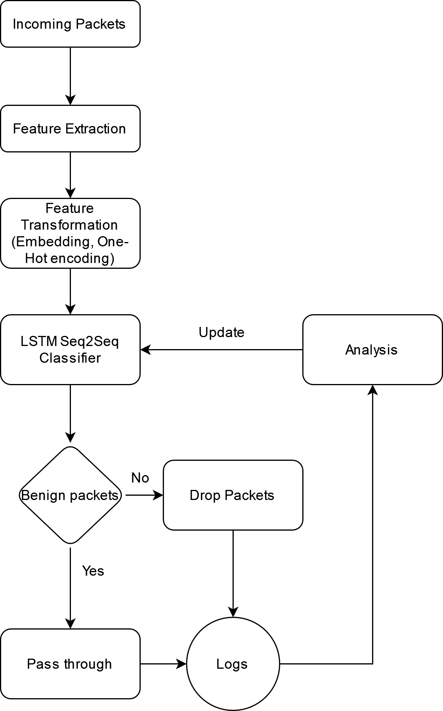

# About the Project

This project is intelligent DDoS/DoS attack detection program.
Unlike other systems out there, It uses Neural Networks to detect susceptible requests at TCP/IP level.
The project is a research project that has been accepted to be published in an International scopus Indexed
peer-reviewed Journal.
Link to the research paper is soon to be updated.

## Setup

The setup contains multiple sessions of attacks where 5 machines are sending benign traffic and 1 machine will be
attacking. Duration and quantity of attack varies in each session
Different data from different perspective of Benign machines, Target Machine and attacker Machines are recorded and
analyzed.

Rest of the project is organized in following way:

## Data

The data folder contains 5 folders each for a different session where duration and the amount of attack varies.

1. **Benign-x.csv**: are the log files for each Benign machine interacting with target machine
2. **info**: contains detailed information of each attack session such as IP addresses of all benign, target and
   attacker machines, time and duration of attack etc.
3. **webserver_logs.csv**: contains logs from target webserver indicating in detail the request received on which route,
   time taken to process it and the final outcome that is, if the request failed or succeeded.
4. **packets.csv**: contains packet level data on TCP/IP level received to the target web server, it is also the data
   that is utilized in the model.

## Data Processing:

The packets data undergoes through various processing before it can be utilized in the model, for detailed overview of
what preprocessing is done and why refer to the Paper.
You can also get overview of methods by looking at */dataset.py* .

One important process to highlight here is the segmentation of IP addresses. Using IP addresses as features is a risky
thing.
To properly utilize them without model overwriting to them and getting biased to one of them is hard but achievable.
This concept is explained in
detail in the actual research paper. But right now, believe that IP addresses are utilized by segmenting them on every '
.' Unfortunately the script written
to collect the data is not returning data x.x.x.x format but xxxx, so I had to create an IP table where every IP address
is stored and corresponding to it is its segmented version.
You can find all tables in *data/ip_tables.py*. On the brightside it gives us opportunity to swiftly replace IP
addresses according to our choice. For example, the attacker IP address is same for all session
since it was done from same machine and in ip_tales I replace the attacker IP with a unique segmented IP.

## Experiments:

This folder contains various functions for fine-tuning the model. Following experiments were performed:
There were other experiments that included testing out various model architecture that are not provided here. After all
experiments Seq2Seq architecture with LSTM was selected. You can study other model architecture in */reports*. It
contains previous experiments and sample of the model used.

| S.No | Experiment       | Values                                                                                                | Expected outcome                                                                               | Selected Value                    |
|------|------------------|-------------------------------------------------------------------------------------------------------|------------------------------------------------------------------------------------------------|-----------------------------------|
| 1    | Learning Rate    | [0.1, 0.01, 0.001, 0.0001, 0.00001], [SGD, Adam, AdamW, NAdam], [OneCycleScheduler, No Scheduler]     | Understanding of what Optimizer and Learning rate fits good with or without OneCypcleScheduler | OneCycleLR, max_lr = 0.001, NAdam |
| 2    | Hidden Size      | [128, 256, 384, 512, 640, 768]                                                                        | Find what size of hidden state works best for LSTM in our model                                | 128                               |
| 3    | Number of Layers | [ 1,  3,  5,  7,  9, 11]                                                                              | Find what number of layers in LSTM provides most optimal results                               | 1                                 |
| 4    | Batch Size       | [64, 128, 192, 256, 320, 384, 448, 512]                                                               | Find which Batch size provides faster training and most optimal results                        | 64                                |
| 5    | Activation       | [nn.ELU, nn.ReLU, nn.LeakyReLU, nn.MultiheadAttention, nn.PReLU, nn.RReLU, nn.GELU, nn.SiLU, nn.Tanh] | Find which activation function works best for our case                                         | LeakyReLU()                       | 
| 6    | Dropout          | [0.1, 0.2, 0.3, 0.4, 0.5, 0.6, 0.7, 0.8, 0.9]                                                         | Find what dropout function prevents overfitting while having least impact on accuracy          | 0.3                               |

## Reports

This folder contains other model architecture tested with their outcomes, in total 3 model architecture were tested

1. **Classic**: In this architecture IP addresses were not utilized, Linear, GRU and LSTM nodes were tested
2. **Embedded**: In this architecture, IP addresses were utilized through embedding. It yielded better results than
   Classic model.
3. **Seq2Seq**: It utilized both LSTM and Embeddings in a Sequence-to-Sequence architecture yielded best results so far.

## Target Web App:

This folder contains Web application built using Flask that was used as target for this study. More details on working
of the application can be found in */target_webapp/README.md*

## Other:

1. */benign.py*: contains script for simulating benign traffic. The script have function that determine when to send
   request to target web application, to what route and how many times before next interval.
2. */sniffer.py*: is script to sniff packets on target web app. This script is mainly used to collect data and yield
   results in csv format.